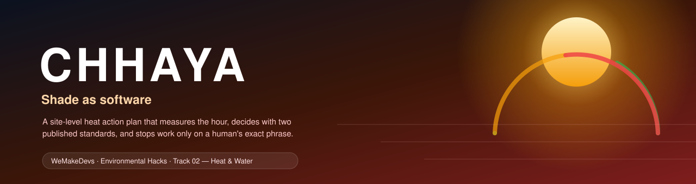
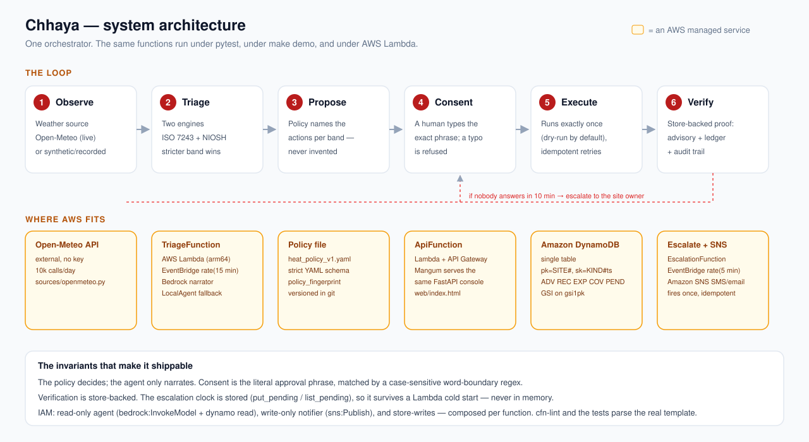
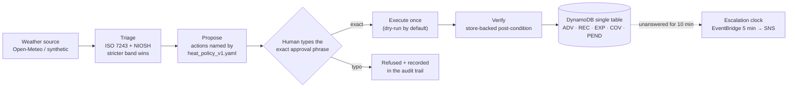
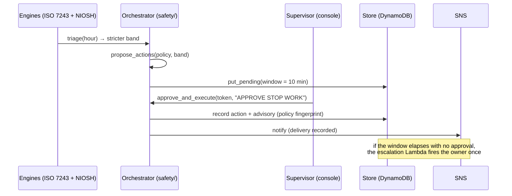

# Chhaya (छाया)

**The site-level heat action plan that measures the hour, decides with two published standards, and refuses to stop work until a human types the exact phrase — then proves it happened.**

> **Track 02 — Heat & Water · WeMakeDevs _Environmental Hacks_.**
> Chhaya means _shade_. Everything below is live code with tests, not a slide:
> the whole loop runs offline in one command, and the same functions run under
> AWS Lambda.

[](https://github.com/ionfwsrijan/Chhaya/actions/workflows/ci.yaml)
[](LICENSE)
[](pyproject.toml)
[](docs/architecture.md)
[](tests/)

**Live console:** https://zxbgr7q9u9.execute-api.ap-south-1.amazonaws.com/prod/ · **Architecture:** [docs/architecture.md](docs/architecture.md) · **Safety:** [docs/safety.md](docs/safety.md) · **Runbook:** [docs/runbook.md](docs/runbook.md) · **Blog:** [docs/blog.md](docs/blog.md) · **Try it locally:** `make setup && make demo && make serve`

It is 2 in the afternoon in Hyderabad, in May. The air is 41 °C and the viaduct
crew is tying rebar in the sun. The supervisor opens the console on a phone.
Two published heat-stress engines — **ISO 7243** and **NIOSH** — have already
run over the hour, and the stricter verdict wins. It says **Stop**. The console
proposes exactly the actions the *policy file* names for that band — stop work,
move the crew to shade — each with the one phrase that approves it. The
supervisor types `APPROVE STOP WORK`. The action executes once (a dry run by
default), its post-condition is checked against the store, and a **standing
advisory** enters force with a bounded TTL. Had nobody answered inside ten
minutes, the **escalation clock** would have called the site owner. Every step
carries the policy fingerprint that was in force.

Nothing here depends on a model making the call. The agent writes the
supervisor-facing explanation; the policy decides what may be proposed. The
safety property is ordinary code, tested **360 times**.

Built solo for the WeMakeDevs _Environmental Hacks_. Everything below is live
code with tests, not a slide.



## Try it in two minutes, no AWS account

```bash
make setup            # once: create .venv, install the package + dev deps
make demo             # walk the whole loop against a synthetic Hyderabad afternoon
make serve            # the console + FastAPI at http://127.0.0.1:8000
```

Open <http://127.0.0.1:8000>, pick an hour, workload and crew size, and triage
it. The console proposes the policy's actions with the exact approval phrase on
each card. Type `APPROVE STOP WORK!` — refused, the boundary check is real.
Type `APPROVE STOP WORK` — executed, and the dry-run receipt, the standing
advisory, the worker-minutes ledger and the audit trail all update. Every call
is the production code path; only the weather (a deterministic fake day), the
store (JSON under `.chhaya/`) and the agent (scripted) are local stand-ins.

No secrets, no network, no API key, no frontend build. `make demo` works with
the wifi off.

---

## What it does, in one hot hour



<details>
<summary>Diagrams as Mermaid (renders on GitHub)</summary>





</details>

```
when ──► source.current(site, when)          # weather: live Open-Meteo or synthetic
  ──► triage(policy, inputs)                 # ISO 7243 + NIOSH, stricter band wins
  ──► propose_actions(policy, result)        # only the actions the YAML names
  ──► approve_and_execute(policy, proposal)  # exact phrase, dry-run flag
  ──► verify_action(...)                     # post-condition, store-backed
  ──► record_*                               # advisory + ledger + audit trail
  ──► [the same functions as Lambda]         # handlers reuse all of this
```

## Where AWS fits

| Service / AWS open source | Role | Where |
|---|---|---|
| **Amazon Bedrock** (Claude 3 Haiku via an inference profile) | drafts the supervisor-facing narration; **never decides** an action | `src/chhaya/agent/bedrock.py` |
| **AWS Lambda + API Gateway (HTTP API)** | serve the very same FastAPI console via Mangum, so the live URL and `make serve` are one app | `src/chhaya/handlers/api.py`, `template.yaml` |
| **Amazon DynamoDB** | single-table store: advisories, action records, exposure, coverage, and the pending proposals that **are** the escalation clock | `src/chhaya/store/dynamo.py` |
| **Amazon EventBridge Scheduler** | triage every **15 minutes**, escalation check every **5 minutes** | `template.yaml` |
| **Amazon SNS** | escalation alerts (SMS/email, parameter-gated) | `src/chhaya/notify/sns.py` |
| **AWS IAM** (managed policies) | a read-only **agent** role, a write-only **notifier** role, and store-writes — composed per function | `template.yaml` |
| **AWS SAM CLI** (AWS open source) | build + deploy; `cfn-lint` runs in CI | `template.yaml`, `.github/workflows/ci.yaml` |

The live stack is up in `ap-south-1` with **`AgentBackend=local`** today: a
brand-new AWS account is under an account-level **Bedrock authorization hold**,
so model access is not yet granted. The safety loop is byte-for-byte identical
with either narrator; enabling Bedrock is a one-parameter redeploy:
`--parameter-overrides AgentBackend=bedrock BedrockModelId=apac.amazon.nova-micro-v1:0`.

## Safety model (the part that matters)

A heat action plan that says "stop" is only worth shipping if you can show
*who decided, why, and that it happened*. Chhaya's controls are in code, not in
a prompt:

1. **Consent is exact.** `check_approval` matches the literal phrase the policy
   printed with a **word-boundary, case-sensitive** regex (`policy/engine.py`).
   `APPROVE STOP WORK!`, `approve stop work` and `APPROVE STOP WORKING` are all
   refused, and the refusal is recorded. A typo is a refusal, not a loophole.
2. **The policy decides.** `propose_actions()` is the only source of actions.
   The bands, phrases, approver roles, TTLs and verification methods live in
   `policies/heat_policy_v1.yaml` — never in the model's output.
3. **Two engines, stricter wins.** `domain/bands.py` runs **ISO 7243** and
   **NIOSH 2016-106 Table 5-1** over the same hour. `merge()` keeps the stricter
   band and records **both** engines' outputs plus the margin; a disagreement is
   treated as "assume the worse one is right".
4. **Executes exactly once.** The proposal is consumed atomically; a retry
   replays the stored result instead of acting twice.
5. **Verify, don't trust.** `verify: store_present` succeeds only if the store
   can show the effect; `supervisor_confirm` returns `PENDING` (never guessed
   complete); `notifier_ack` requires the notifier's own delivery result.
6. **The clock is stored, not in memory.** Every Stop-band proposal is persisted
   as a `PendingProposal` with a **10-minute** window. A separate Lambda
   (`EscalationFunction`, 5-minute schedule) lists unresolved proposals and
   fires the owner **once** each. `resolved`/`escalated` flags make it
   idempotent across restarts — the clock survives a cold start.
7. **The agent fails safe.** `BedrockAgent` raises `AgentError` on any failure;
   the caller falls back to the scripted `LocalAgent`. A model can never invent
   an action.
8. **Every number cites a source.** Constant and schedule in `domain/` traces to
   Stull (2011), ISO 7243:2017, NIOSH 2016-106, Rothfusz (1990) or Bolton
   (1980); a test named after the source re-derives it. The three corrections
   from primary sources are in [`docs/LEARNINGS.md`](docs/LEARNINGS.md).

Details: [`docs/safety.md`](docs/safety.md).

## Run it

### Locally, no AWS account

```bash
make setup        # create .venv, install the package + dev deps
make demo         # walk the whole loop against synthetic Hyderabad weather
make serve        # console at http://127.0.0.1:8000
make test         # 360 tests, 94% coverage (DynamoDB via moto — no AWS access)
make lint         # ruff + ruff-format + mypy --strict
```

Or without Make:

```bash
python -m venv .venv && .venv/Scripts/pip install -e ".[dev,aws]"
python -m chhaya.cli demo
python -m chhaya.cli serve
```

The deterministic replay uses the exact Open-Meteo shape, so the hour the demo
shows can be replayed identically in the room:

```bash
CHHAYA_SOURCE=recorded CHHAYA_RECORDING=demo/fixtures/hyderabad-may-18.json \
  python -m chhaya.cli demo
```

### On AWS (the _ship it_ path)

```bash
sam build
sam deploy --guided \
  --parameter-overrides AgentBackend=local BedrockModelId=apac.anthropic.claude-3-haiku-20240307-v1:0
```

The deploy used here (region `ap-south-1`, `--resolve-s3`, `cfn-lint` clean):

```bash
sam deploy --stack-name chhaya --region ap-south-1 \
  --capabilities CAPABILITY_IAM --no-confirm-changeset --no-fail-on-empty-changeset \
  --resolve-s3 \
  --parameter-overrides AgentBackend=local BedrockModelId=apac.anthropic.claude-3-haiku-20240307-v1:0
```

Outputs: **`ConsoleUrl`** (the live console), `HeatTableName`, `AlertsTopicArn`.
Two caveats, stated honestly:

- **Bedrock** on a new account can sit under an authorization hold. Until it
  clears, deploy with `AgentBackend=local`; the entire loop is identical and
  `/api/config` says so.
- **SMS** endpoints must be verified for the region. `SiteOwnerPhone` /
  `SiteOwnerEmail` are parameter-gated, so an empty value simply skips the
  subscription (`chhaya-heat-alerts` publishes regardless).

Run a single scheduled step by hand — the same function the Lambda calls:

```bash
python -m chhaya.cli triage     # == TriageFunction
python -m chhaya.cli escalate   # == EscalationFunction
```

## Repository map

```
src/chhaya/
  domain/      heat.py (Stull WBGT, ISO 7243 + Annex D), niosh.py (Table 5-1),
               workload.py (ISO 8996), screening.py, bands.py (merge: stricter wins)
  policy/      strict extra="forbid" YAML schema, policy_fingerprint, word-boundary consent
  safety/      orchestrator.py · actions.py · verify.py · advisory.py · exposure.py · escalate.py
  sources/     openmeteo.py (live) · recorded.py (fixture) · fake.py (deterministic day)
  agent/       base.py · local.py (scripted) · bedrock.py (converse via boto3, raises AgentError)
  notify/      base.py · console.py · sns.py
  store/       base.py (HeatStore protocol) · rows.py (shared codec) · local.py (JSON) · dynamo.py (single table)
  api/         app.py (FastAPI) · models.py (NaiveDatetime) · session.py (one-shot propose tokens)
  handlers/    api.py (Mangum + stage strip) · triage.py · escalation.py (Lambda entry points)
  runtime.py   describe() — names the live backends; never hides a degraded path
  settings.py  local vs aws in one place (safe defaults; no env needed for local)
  cli.py       serve / triage / escalate / demo
policies/      heat_policy_v1.yaml — the whole of what Chhaya is allowed to do
web/           index.html — the single-file, zero-build console
demo/          fixtures/hyderabad-may-18.json — the deterministic replay
template.yaml  SAM: single-table DynamoDB, SNS, 3 Lambdas, 4 least-privilege managed policies
docs/          architecture.md · safety.md · runbook.md · submission.md · LEARNINGS.md · blog.md
tests/         360 tests: domain, policy, safety loop, sources, agents, notifiers, stores (moto), runtime, API, handlers
```

## Development

```bash
make help        # every target, one line each
make test        # pytest with coverage
make lint        # ruff format --check, ruff check, mypy --strict
cfn-lint template.yaml
```

Tests are the spec. The safety model is asserted directly: one test per
mis-typed consent variant (`tests/test_policy.py`), the stricter-wins merge
(`tests/test_bands.py`), the store-backed verifier (`tests/test_safety.py`),
the escalation clock across restarts (`tests/test_safety.py`), and the DynamoDB
store under moto (`tests/test_store_dynamo.py`). CI runs the full gate on every
push to `main`.

## Production notes

What "production-minded" means here, and where each claim is enforced:

| Concern | Where |
|---|---|
| Least privilege: read-only agent (Bedrock invoke + Dynamo read), write-only notifier (SNS publish), store-writes — composed per function | `template.yaml`; asserted by `cfn-lint` in CI |
| Consent fails closed: case-sensitive, word-boundary regex; a typo is a recorded refusal | `policy/engine.py`, `tests/test_policy.py` |
| Bedrock fails safe: any error raises `AgentError` → the scripted fallback narrates | `agent/bedrock.py`, `tests/test_agent.py` |
| Exactly-once execution and exactly-once escalation via `resolved`/`escalated` flags | `safety/actions.py`, `safety/escalate.py`, `tests/test_safety.py` |
| The store is the source of truth, including for the clock (`put_pending`/`list_pending`) | `store/`, `tests/test_store_dynamo.py` (moto) |
| One (de)serializer for every record across Local and Dynamo stores | `store/rows.py` |
| Timezone-safe timestamps: normalized to naive UTC at the API boundary and in `iso()` | `api/models.py`, `store/rows.py`, `tests/test_api.py` |
| HTTP API stage prefix stripped before routing, so `/prod/api/*` and `/api/*` agree | `handlers/api.py`, `tests/test_handlers.py` |
| Honest mode reporting: `/api/config` names the live source, store, agent and notifier | `runtime.py` |
| AWS resources: DynamoDB `PAY_PER_REQUEST` + PITR + SSE; arm64 Lambdas; active tracing; parameter-gated SNS | `template.yaml` |

Known gaps, on purpose for a hackathon: local mode's weather is synthetic and
the site/crew/phone values are examples; there is no SMS-to-console approval
loop yet (approvals come from the console); and the escalation is a logged /
SNS message, not a real call tree. These are listed in
[`docs/LEARNINGS.md`](docs/LEARNINGS.md) too.

## License

Apache-2.0. This is a hackathon build; the physics citations live in the code.
